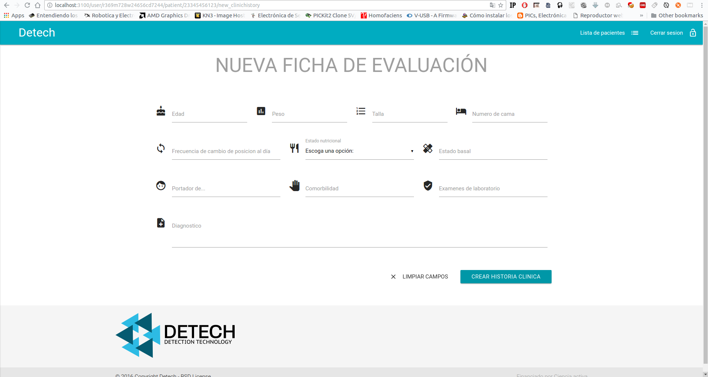
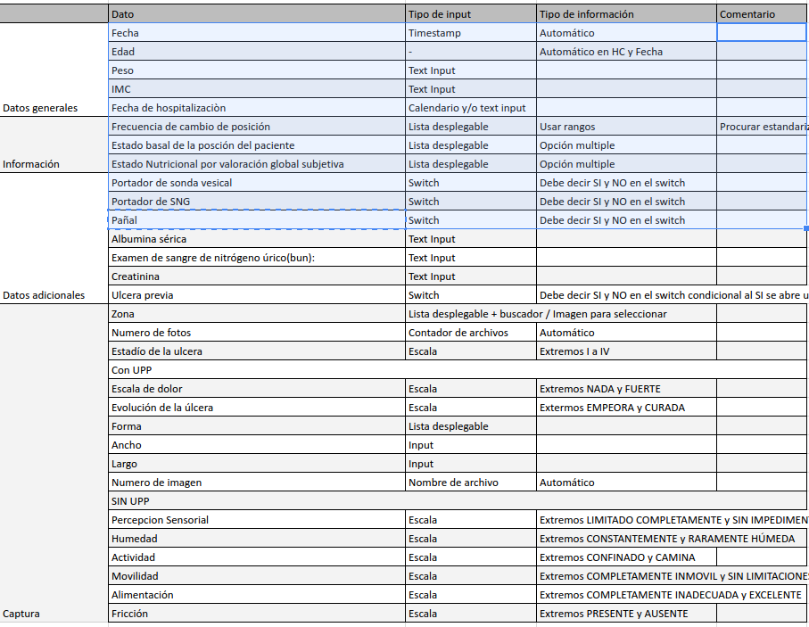
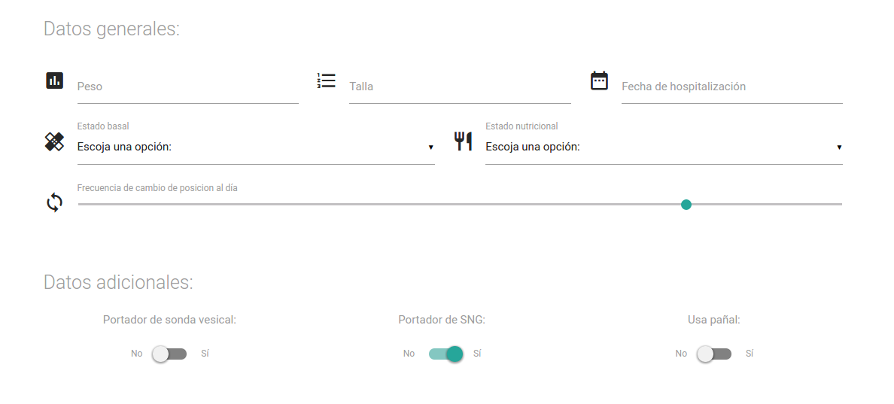
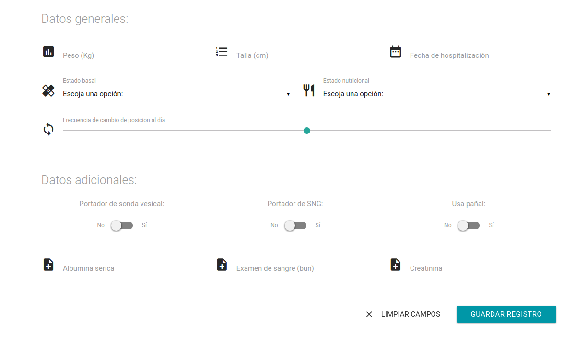
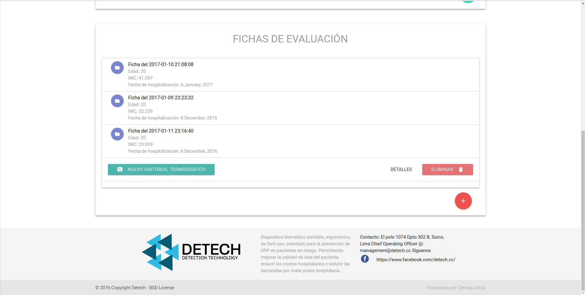
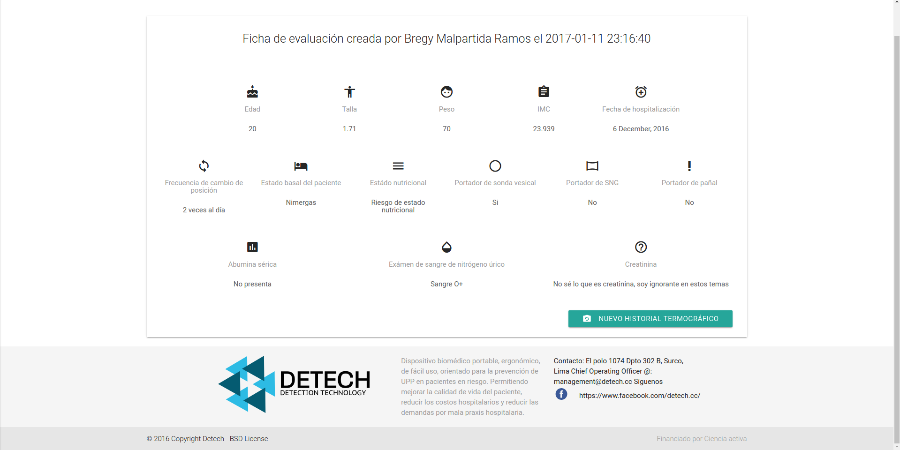

# Sistema web para el manejo de pacientes

##Changelog:
### Miercoles 4 de enero del 2017:
1. Añadidas funciones para subida de imagenes a la base de datos.

2. Las entrada de data para las fichas de evaluacion requieren mejoras.

### Jueves 5 de enero del 2017:
1. Actualizados los requerimientos de la ficha de evalución, se añadieron los tipos de datos a usar por cada campo a llenar.
Esto se puede observar en el cuadro a continuación:

2. Creada la nueva página que contemplará todos los datos actualizados, 
un 40% terminado (Se puede observar en el cuadro que los datos sombreados ya están sintetizados).
Adjunto una imagen del avance de este tramo de la web.

3. Añadidas funciones a bajo nivel para procesar las imágenes en el algoritmo del lado del servidor,
 iniciadas pruebas llamando desde Go a un script en python.
 
### 6 y 7 de enero del 2017:

1. Mejorado el binding de la base de datos, admitiendo datos del tipo "Ficha de evaluación"

2. Página para creación de nueva ficha de evaluación completada al 100%

### 8 y 9 de enero del 2017:

1. Añadida ṕagina de visualización de fichas de evaluación

2. Mejorada la forma de envio y recepción de datos, especificamente se volvio concurrente el sistema de actualización
de la DB de Firebase.

3. Añadidos los controles respectivos al historial termográfico, un 60% del total.

4. Añadida información del footer en la página.

### 10, 11 y 12 de enero del 2017:

1. Completada al 100% la visualización de las fichas de evaluación:

